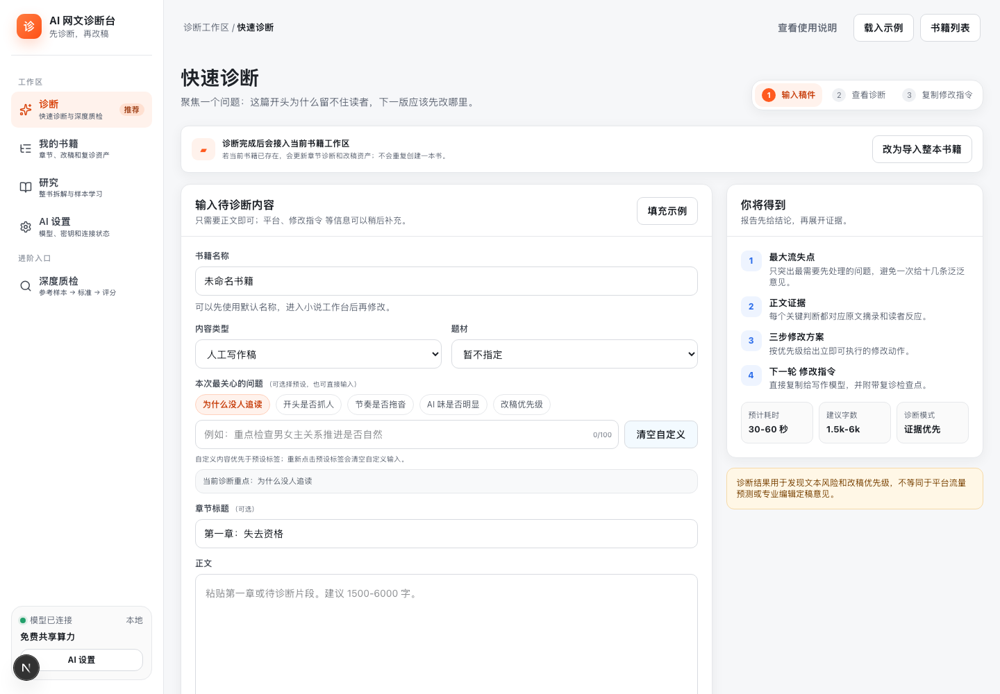

# AI Novel Diagnosis Desk

[简体中文](./README.md) | [English](./README.en.md)

[](https://github.com/myyimu/ai-novel-diagnosis/actions/workflows/ci.yml)
[](./LICENSE)

Do not rush into AI rewriting. First inspect the evidence like an editor, choose a priority, and verify whether the revision worked.

AI Novel Diagnosis Desk is a local, evidence-led writing coach. It turns mature editorial checklists, judgment rules, evidence patterns, revision strategies, and retest criteria into a workflow writers can execute. It is not a one-click generator, an objective quality judge, or a traffic predictor.

It covers chapter triage, full-story audits, relationships and timelines, reference study, revision plans, and versioned retests. Findings must link back to text evidence and remain open to author confirmation, intent, rejection, or deferral.

Paste a first chapter and it proposes the highest-priority reading-risk hypothesis, explains the evidence and plausible alternatives, sets revision boundaries, and generates a prompt for a writing AI. Save the revised text as a real new version, then use issue-state comparison and independent review to test whether the change helped.

For advanced use, it also supports AI book analysis: characters, relationships, worldbuilding, timelines, story structure, and exportable writing assets for learning mature works without copying them.

> Alpha status: suitable for local experiments, feature validation, and feedback collection. Do not expose it as a production public service yet.

The authoritative product direction and scientific boundaries are in [`docs/product-doctrine.md`](./docs/product-doctrine.md).

## Try It In 3 Minutes

On Windows, double-click:

```text
scripts/start-local.cmd
```

On macOS, double-click:

```text
scripts/start-local-mac.command
```

The script checks Node.js / pnpm, installs missing dependencies, starts the API and Web app, and opens the page automatically. After the page opens, skip advanced configuration at first. Paste your first chapter and run chapter triage.

If you are already in a terminal at the repository root on Windows, run:

```powershell
pnpm run start:local
```

On macOS, run:

```bash
pnpm run start:local:mac
```

Default URLs:

```text
Web: http://127.0.0.1:3000
API: http://127.0.0.1:3001/api/v1
```

## What You Get

- A clear diagnosis of the biggest first-chapter drop-off risk: opening, hook, emotion, pacing, setup, or market promise.
- An evidence-backed editorial hypothesis about text signals that may affect willingness to continue.
- A copyable revision prompt: concrete instructions you can pass to a writing AI, not vague critique.
- A versioned retest loop: preserve before/after text and compare resolved, recurring, and newly introduced issues instead of relying on a score alone.
- Advanced assets: reference-sample rubrics, full-book character/world analysis, relationship graphs, timelines, and export packs.

## Why Not Use Built-In Review From A One-Click Writing Tool

One-click writing tools are good at producing more text. AI Novel Diagnosis Desk focuses on how an editor inspects evidence, chooses a revision, and verifies the result.

| One-click writing tool | AI Novel Diagnosis Desk |
| --- | --- |
| Generates more prose | Turns editorial judgment into a verifiable revision workflow |
| Often gives generic critique | Ties diagnosis to text evidence |
| Tends to rewrite for you | Explains the cause before giving a revision prompt |
| Hard to compare before and after | Supports a retest loop |
| Usually a one-off output | Builds rubrics, relationship graphs, world books, and export assets |

Short version:

```text
One-click writing tools help you write more. AI Novel Diagnosis Desk helps you judge, revise, and learn like an editor.
```

## How It Diagnoses What Is Wrong

It should not only give a score, and you should not have to blindly trust AI. The report follows one evidence chain:

```text
Editorial standard -> Candidate issue -> Text evidence -> Possible reader impact -> Author decision -> Revision boundary -> Revision prompt -> Versioned retest
```

It focuses on:

- Which chapter-one signals may increase drop-off risk.
- Whether the title/blurb promise matches the chapter experience.
- Whether the protagonist has a concrete goal, pressure, loss, and choice.
- Whether payoff, conflict, and emotion arrive too late.
- Whether exposition blocks the story.
- When real behavior data exists, which text risks may be associated with clicks that do not convert into continued reading.

It does not predict platform algorithms. Without controlled behavior data, it presents text-side risk hypotheses rather than claiming the cause of actual reader loss.

## Is AI Book Analysis Just Copying

No. AI book analysis is not for copying source works. It extracts structural lessons:

- Character functions.
- Conflict rhythm.
- Worldbuilding organization.
- Relationship evolution.
- Timelines.
- Reusable structure.
- Do-not-copy list.

The principle is: learn structure, do not copy content.

## Screenshot



_The interface is evolving quickly; use the current app as the source of truth._

## Contents

- [Try It In 3 Minutes](#try-it-in-3-minutes)
- [What You Get](#what-you-get)
- [Why Not Use Built-In Review From A One-Click Writing Tool](#why-not-use-built-in-review-from-a-one-click-writing-tool)
- [How It Diagnoses What Is Wrong](#how-it-diagnoses-what-is-wrong)
- [Is AI Book Analysis Just Copying](#is-ai-book-analysis-just-copying)
- [Who It Is For](#who-it-is-for)
- [Recommended Workflow](#recommended-workflow)
- [Core Capabilities](#core-capabilities)
- [Tech Stack](#tech-stack)
- [Model Providers](#model-providers)
- [Local Development](#local-development)
- [Workspace](#workspace)
- [Local Data](#local-data)
- [Quality Gates](#quality-gates)
- [Current Limitations](#current-limitations)
- [Friendly Links](#friendly-links)
- [Open Source](#open-source)

## Who It Is For

Good fit:

- New web novel writers who finished a first chapter but do not know why readers may drop off.
- Writers who want a systematic text review and, when behavior data is available, a cautious investigation of why readers may not continue.
- Writers who want AI critique to become executable revision tasks, not comments like "the pacing is slow".
- Writers who want to learn how mature samples deliver genre promise, character relationships, and emotional payoffs.
- Creators who want to turn a full TXT novel into character cards, world books, relationship graphs, timelines, and writing assets.

Not a good fit:

- Users who want AI to ghostwrite a whole book.
- Users who want to copy source works through analysis outputs.
- Teams that need accounts, permissions, collaboration, and production hosting.

## Recommended Workflow

For first-time users, start with the shortest loop:

```text
Paste a chapter -> inspect evidence -> confirm or reject issues -> save a revision plan -> create V2 -> run an independent retest -> decide whether the lesson should be retained
```

When you need a deeper critique, move into the advanced workflow:

```text
Import a mature reference chapter -> infer market positioning -> generate a scoring rubric -> score your own chapter with the same standard
```

When you already have a complete TXT file or multiple samples, move into full-book analysis:

```text
Upload a full TXT -> preview chapter split -> run Map-Reduce analysis -> review the relationship graph -> export character/world/continuation assets
```

The current UI is organized into four workspaces: `/diagnose` for chapter diagnosis, with `/diagnose/quick`, `/diagnose/deep`, `/diagnose/score`, and `/diagnose/evidence`; `/project` for current projects, retests, methodology cards, and export; `/research` for full-book analysis, sample comparison, pattern study, and research materials; and `/settings` for model providers, dashboards, and history. `/` opens quick diagnosis. Older routes such as `/critique`, `/book`, `/library`, `/history`, `/export`, and `/model` remain as compatibility entry points.

## Core Capabilities

First-chapter triage:

- Paste your own first chapter and get positioning, selling points, a highest-priority issue candidate, concrete fixes, and a revision prompt.
- Save the revised chapter as a real version and compare issue states and evidence; `quickScore` is only a compatibility severity summary.
- Start without reference samples, platform profiles, or complex configuration.

Advanced chapter critique:

- Analyze a mature reference chapter and infer category, theme, tags, implicit expectations, and title/blurb promises.
- Generate a transferable rubric, then inspect your chapter against the same standard; evidence and action take priority over an aggregate score.
- Use impressions, CTR, 30s/60s read retention, completion rate, and follow rate as diagnostic context.

Full-book visual analysis:

- Upload a TXT file, clean text, preview chapter splitting, and run async Map-Reduce analysis.
- Save each completed chapter map locally, so token exhaustion or job failure does not waste completed work.
- Extract characters, factions, locations, worldbuilding, plotlines, timelines, and reusable writing assets.

Relationship graph workbench:

- Turn full-book results into an interactive graph with overview, review, timeline, node dragging, and graph export.
- Confirm weak-evidence edges, edit relation labels, merge duplicate nodes, or ignore noisy nodes.
- Export Markdown, JSON, Tavern character cards, World Book, SillyTavern World Info, continuation packs, style bibles, outlines, prompt packs, and Do Not Copy lists.

## Tech Stack

- Monorepo: One CLI
- Web: Next.js
- API: NestJS
- Desktop shell: Electron
- DB: PostgreSQL / PGlite fallback
- Package manager: pnpm
- Model provider: shared/public entry points, BYOK, OpenAI-compatible

## Model Providers

The app provides public/shared model entry points by default and also supports BYOK. User-provided API keys are sent per request and are not persisted.

- mock: local demo and automated validation.
- AI Horde public pool: anonymous low-priority shared queue.
- OpenRouter free models: backend-configured OpenRouter key, with no frontend key required.
- Shared compute: backend-configured OpenAI-compatible shared line.
- DeepSeek.
- Doubao / Volcengine Ark.
- Alibaba Cloud Bailian / Tongyi Qianwen.
- Ollama local models.
- Custom OpenAI-compatible endpoints.

## Local Development

For a quick product trial, start with [Try It In 3 Minutes](#try-it-in-3-minutes). This section is for developers and users who need startup options.

`scripts/start-local.cmd` runs environment checks before startup: Node.js / pnpm validation, normal pnpm install when dependency links are supported, a copied local-package fallback when the current drive cannot create dependency links, one clean retry when generated `node_modules` links are normally corrupted, automatic restart of this project's API/Web services, nearby port search when another service owns a port, and API/Web logs under `.local/run-logs`.

If the shared model path is unavailable or slow, switch to your own model provider in "AI Settings".

For engineering work, One CLI is the recommended path.

Install dependencies first:

```bash
pnpm install
```

Start the full workspace with One CLI:

```bash
pnpm run dev:dry-run
pnpm run dev
```

`pnpm run dev` is managed by One CLI and starts `web`, `api`, and `ai-core` according to `one.manifest.json`.

If One CLI is not installed, use the raw pnpm startup path:

```bash
pnpm run dev:raw
```

This starts `web`, `api`, and `ai-core` in parallel without the `one` command.

Windows one-click local startup for first-time users:

```text
scripts/start-local.cmd
```

This entry point runs environment checks first, then starts the app:

- checks Node.js and pnpm against the project version policy.
- guides dependency installation; `scripts/start-local.cmd -a` uses auto-install mode.
- runs `pnpm install` when workspace dependencies are missing.
- reuses healthy project services, or searches nearby ports when defaults are occupied.
- opens separate API and Web PowerShell windows and writes logs to `.local/run-logs`.
- opens the Web page after startup unless disabled.

If you are already in a terminal at the workspace root, use the equivalent npm script:

```powershell
pnpm run start:local
```

macOS one-click local startup:

```bash
scripts/start-local-mac.command
scripts/start-local-mac.sh --auto-install
pnpm run start:local:mac -- --no-browser
pnpm run start:local:mac -- --reuse
pnpm run start:local:mac -- --web-port 3100 --api-port 3101
```

Use `scripts/start-local-mac.command` for double-click startup and `scripts/start-local-mac.sh` from Terminal. The script starts API and Web in the same Terminal window, sets the local API URL and PGlite directory, writes logs to `.local/run-logs`, and stops services started by this launcher when you press `Ctrl+C`.

Common startup commands:

```powershell
scripts/start-local.cmd
scripts/start-local.cmd -a
pnpm run start:local -- -NoBrowser
pnpm run start:local -- -Reuse
pnpm run start:local -- -WebPort 3100 -ApiPort 3101
```

The startup script now checks `Node.js` and `pnpm` automatically before launching `api` and `web`.
This project now declares its Node.js baseline in `.nvmrc` and `package.json#engines`.
If Node.js is missing or too old, the script will try to use that project version first.
If `pnpm` is missing, it will try to activate `pnpm@10.14.0` with `corepack` first, then fall back to `npm install -g`.
In most cases the script can continue in the same window after installation. Only reopen the terminal if it explicitly says the current shell still cannot find `node` or `pnpm`.
See [scripts/START-LOCAL-GUIDE.md](./scripts/START-LOCAL-GUIDE.md) for the consolidated bilingual startup guide.

Start individual projects with One CLI:

```bash
pnpm run dev:web
pnpm run dev:api
pnpm run dev:core
```

Start individual projects without One CLI:

```bash
pnpm run dev:web:raw
pnpm run dev:api:raw
pnpm run dev:core:raw
```

Default local URLs:

```text
Web: http://localhost:3000
API: http://localhost:3001/api/v1
Health: http://localhost:3001/health
```

Open the Web URL for the app UI. `http://localhost:3001` is the API server root, so opening it directly may show `Cannot GET /`; that does not mean startup failed. Use `http://localhost:3001/health` for the API health check and `http://localhost:3001/api/v1` for API information.

## Workspace

- `apps/web`: Next.js console for chapter triage, advanced critique, AI settings, and full-book analysis.
- `apps/desktop`: Electron desktop shell. In development it loads the local Web app; packaged builds start bundled API and Next sidecars.
- `services/api`: NestJS API for text cleaning, chapter splitting, async jobs, full-book analysis, and exports.
- `packages/ai-core`: Shared editorial issue, evidence, retest, and compatibility scoring contracts.

## Local Data

If `DATABASE_URL` is not configured, the API uses `.local/pglite` as the local development database.

## Docker Compose

Docker Compose is suitable for local deployment or demos when Docker Desktop is already installed. Non-engineering users should usually start with `scripts/start-local.cmd`.

Copy the root environment template and start the stack:

```bash
cp .env.example .env
docker compose up --build
```

Default URLs:

```text
Web: http://localhost:3000
API: http://localhost:3001/api/v1
Health: http://localhost:3001/health
```

The compose stack starts only the services currently used by the code: `postgres`, `api`, and `web`.

Uploaded text, normalized text, and upload snapshots are stored under:

```text
.local/analysis
```

Chapter-map artifacts from full-book jobs are stored under:

```text
.local/artifacts/{jobId}/map-{chapterId}.json
```

By default, local upload storage is plaintext for easier development and debugging. For real manuscripts or commercial drafts, set `ANALYSIS_STORAGE_KEY` to enable local privacy mode. When the key is set, uploaded raw text, normalized text, and upload snapshots are stored as AES-256-GCM `.enc` files and decrypted transparently by the API. Keep this key safe; encrypted local uploads cannot be recovered if the key is lost.

`.local` is ignored by Git. Do not commit uploaded novels, model outputs, local databases, or API keys.

## Quality Gates

```bash
pnpm run one:doctor
pnpm run check
pnpm run test
pnpm run build
pnpm run ci
pnpm run container:prepare
pnpm run container:dry-run
pnpm run doctor
```

`check` runs lint and formatting checks for each project. Formatting is scoped to code and config files to avoid rewriting One CLI generated `CLAUDE.md` / `AGENTS.md` files.

`container:prepare` builds web / api and writes the production artifacts needed by One CLI project-directory Docker contexts into `.one-container`. The directory is temporary and ignored by Git.

`one:doctor` checks the One CLI workspace manifest, `one dev --dry-run`, Docker container targets, Kustomize ports/env, `.one-container` production artifacts, and deploy profile status. A missing local Kubernetes/kustomize deploy profile is reported as a warning and does not block normal development checks.

`doctor` runs the full `ci` script, then `container:prepare` and `one:doctor`. The workspace CI job uses this same entry point.

## Current Limitations

- This is an Alpha / MVP project. Outputs are evidence-backed editorial hypotheses, not independently validated objective measurements.
- `quickScore` summarizes issue severity for compatibility; `confidence` summarizes evidence/context sufficiency. Neither is a quality score or calibrated probability of correctness.
- A repeated cached result or same-model self-review does not demonstrate that a revision worked; product-effect claims require independent editor labels and controlled before/after evaluation.
- Revision text versions and human review states for story-audit findings are persisted. Per-issue decisions for chapter triage, actual adoption tracking, and a complete independent retest remain under development; missing objects must not be presented as evidence that a revision worked.
- Partial results are persisted, and failed/interrupted full-book jobs have a basic resume path. More granular partial export and persisted graph-review corrections are still being iterated.
- Relationship graphs support local manual corrections and correction-aware JSON export, but correction records are not yet stored as a separate database entity.
- For real PostgreSQL deployments, use committed Drizzle migrations. Generate a new migration after schema changes, then run `pnpm --filter api db:migrate`.
- There is no account system yet. The project is currently best suited for local single-user deployment.
- The tool only provides analysis, learning, critique, and export features. Users are responsible for confirming they have the necessary rights or legal basis for uploaded texts and exported assets.

## Friendly Links

- [linux.do](https://linux.do/)
- [One CLI](https://github.com/1cli-team/one-cli)
- [mediago-drama](https://github.com/mediago-dev/mediago-drama)

## Open Source

- License: MIT. See [LICENSE](./LICENSE).
- Repository: [github.com/myyimu/ai-novel-diagnosis](https://github.com/myyimu/ai-novel-diagnosis)
- Contact: [xiaoke5211@gmail.com](mailto:xiaoke5211@gmail.com)
- Contributing: see [CONTRIBUTING.md](./CONTRIBUTING.md)
- Product doctrine and evaluation boundaries: see [docs/product-doctrine.md](./docs/product-doctrine.md)
- Security policy: see [SECURITY.md](./SECURITY.md)
- GitHub Social Preview candidate: [docs/assets/github-social-preview.png](./docs/assets/github-social-preview.png).

## Recommended GitHub Topics

```text
ai-novel
ai
llm
artificial-intelligence
prompt-engineering
natural-language-processing
knowledge-graph
text-analysis
storytelling
webnovel
novel
novel-analysis
book-analysis
novel-diagnosis
webnovel-diagnosis
ai-writing
writing-assistant
relationship-graph
writing
writing-tools
```

## One CLI

The real workspace state is defined by `one.manifest.json`. Useful commands:

```bash
one dev --dry-run -o json
one container info -o json
one container build --dry-run -o json
```
