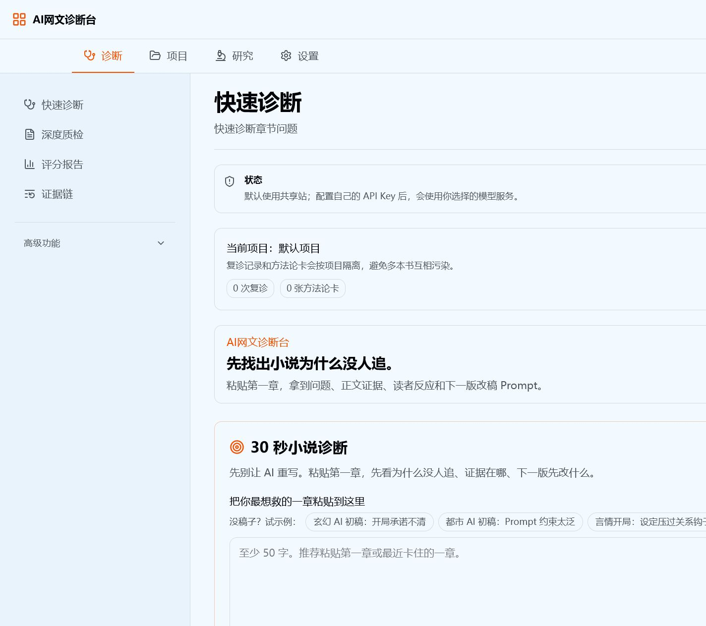
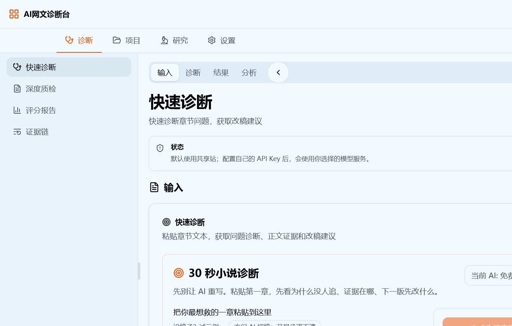

# 前端 UX 重构：当前结构与行为基线

日期：2026-07-10

## 结论摘要

当前前端不是“旧单页已被三栏替代”，而是三套层级同时存在：

1. 顶部四工作区导航：诊断、项目、研究、设置；
2. 左侧工作区子导航；
3. 三栏模式中的主区四个 Tab 与右栏六个 Tab。

路由看似拆成 15 个页面，实际仍由一个 `NovelCritiqueConsole`、一个超大 `useWorkspaceHandlers` 和一个全局 `workspace-store` 承载。很多新路由只是在同一旧视图上换标题或默认 Tab，并没有形成独立任务边界。

本文件中的“原始结构”以三栏引入前的提交 `8592f74`、当前保留的经典布局和本轮实际渲染为依据；三栏首个大规模落地提交为 `97dd60c`，一次新增约 3986 行前端代码。

## 审计范围与证据

- 代码：`apps/web/src/app`、`components/workspace`、`novel-critique-console.tsx`、`hooks/use-workspace-handlers.ts`、`stores`、`lib/workspace-*`、样式和测试。
- 历史：`8592f74`（三栏前）与 `97dd60c`（三栏首次完整落地）。
- 实际运行：`http://127.0.0.1:3000`，桌面 1440×900、平板 1024×768、移动端 390×844。
- 代表流程：示例章节 → 快速诊断 → 完整报告 → 三栏诊断摘要 → 深度质检。
- 运行限制：共享算力在本轮返回 521；完整流程改用项目内置“本地演示”完成。该外部服务故障不是布局缺陷，但原始 HTML 被直接暴露给用户是错误呈现风险。

## 原始单页结构

### 页面外壳

三栏引入前，`/` 直接渲染 `NovelCritiqueConsole view="overview"`。`WorkspaceShell` 是两区结构：

```text
页面
├─ 左侧导航（桌面固定 256px；小屏转横向）
│  ├─ 快速诊断
│  ├─ 深度质检
│  ├─ 评分/整书等主入口
│  └─ 高级功能折叠区
└─ 单一主内容列
   ├─ 当前视图标题与说明
   ├─ 全局状态
   ├─ 当前项目上下文
   └─ 当前 activeView 的完整纵向内容
```

用户一次只进入一个 `activeView`。视图内部虽然很长，但阅读顺序由 DOM 和纵向滚动明确决定。

### 快速诊断原始阅读顺序

当前经典模式仍保留这一结构，可作为旧行为基线：

1. 当前视图标题与状态；
2. 当前项目选择/新建；
3. 产品价值说明与当前模型状态；
4. 章节正文输入、示例、题材/输入类型和可选约束；
5. 生成改稿方案；
6. 加载或错误状态；
7. 完整诊断报告：处理建议、卖点、最大问题、证据、读者影响、修改动作；
8. 可复制改稿 Prompt；
9. 方法论卡、复诊资产和后续深度能力；
10. 低频说明与进阶能力折叠区。

优势是因果顺序清楚；问题是输入、结果、历史摘要、方法论和进阶入口仍在同一长页，结果产生后输入区也不会让位。



## 当前三栏结构

### 实际渲染树

```text
页面
├─ WorkspaceHeader
│  ├─ 品牌 + 布局切换
│  └─ 四工作区顶部导航
└─ NovelCritiqueConsole
   └─ ThreeColumnWorkspaceShell
      └─ WorkspaceLayout（固定视口高度、overflow hidden）
         ├─ 左栏：当前工作区子导航
         ├─ 中栏：输入 / 诊断 / 结果 / 分析
         └─ 右栏：诊断历史 / 参考资料 / 项目范围 / AI 设置 / 历史任务 / 新手引导
```

三栏不是按当前任务选择内容，而是几乎在所有路由上构造相同的四个主 Tab 和六个右栏 Tab。路由元数据只改变默认主 Tab 与默认右栏 Tab。

### 三栏中的内容归属

- “输入”Tab 不只是输入：它包含完整 `QuickExperiencePanel`，因此结果生成后完整报告仍在“输入”Tab 内；它还附带“书籍上传”和“AI 提供商设置”卡片，其中书籍上传明确写着尚未完整实施。
- “诊断”Tab 再次展示快速诊断摘要、评分标准、平台策略和“打开完整诊断”。
- “结果”Tab 混合项目复诊、方法论、整书状态、看板和导出。
- “分析”Tab 混合整书分析、图谱、研究就绪度和研究入口。
- 右栏六个 Tab 在所有页面都存在，既承担上下文，也承担导航、设置、历史和帮助。
- 左栏宽度、右栏宽度、开关状态、主 Tab 和右栏 Tab 全部用全局 localStorage key 持久化，不按工作区或路由隔离。



## 页面功能模块与实际落点

| 业务模块 | 用户动作/输出 | 经典布局实际组件 | 三栏实际位置 | 主要状态依赖 |
| --- | --- | --- | --- | --- |
| 快速诊断 | 粘贴章节、选择题材/来源、生成报告 | `OverviewView` → `QuickExperiencePanel` | “输入”Tab 内的完整 `QuickExperiencePanel` | chapter、quickReview、provider、cache、project |
| 完整诊断报告 | Gate、问题、证据、动作、Prompt | 同一快速诊断长页结果段 | 仍在“输入”Tab；“诊断”Tab另有摘要 | `quickReviewResult` |
| 深度质检 | 参考章节、评分标准、章节评分 | `ChapterCritiqueView` | “诊断”Tab | reference、rubric、score、platform、performance |
| 评分报告 | 分数、分项与证据 | `ChapterCritiqueView` 内 | `/diagnose/score` 仍默认到同一“诊断”Tab | `rubricResult`、`scoreResult` |
| 证据链 | 诊断依据 | `ChapterCritiqueView` 内 | `/diagnose/evidence` 仍默认到同一“诊断”Tab | quick/score evidence |
| 项目选择/新建 | 切换项目上下文 | 每个视图顶部 `ProjectScopePanel` | 右栏“项目范围”只读；主区项目操作不完整 | projects、activeProjectId |
| 复诊记录 | 历史版本、备注、对比 | `RevisionHistoryView` | “结果”Tab + 右栏“诊断历史”重复 | revisionSessions、project |
| 方法论库 | 规则、复用 Prompt | `MethodologyLibraryView` | “结果”Tab + 右栏“参考资料”重复 | methodologyCards、project |
| 诊断看板 | 趋势和问题分布 | `DiagnosisDashboardView` | “结果”Tab | revisionSessions、methodologyCards |
| AI 设置 | 模型服务、连接、历史 | 独立 provider 视图 | 输入卡片 + 右栏 + provider 路由三处出现 | provider、provider history |
| 整书拆解 | 上传、预览、异步任务、结果 | book 视图纵向流程 | “分析”Tab只有摘要/入口；完整操作仍依赖旧 book 视图 | book upload/job/result/cache |
| 历史整书任务 | 恢复、删除、继续 | book/history 视图 | “分析”摘要 + 右栏“历史任务” | bookHistory、bookJob |
| 导出 | 项目 Markdown、整书资产 | project export / book utility | “结果”或“分析”入口 | active project 或 succeeded bookJob |
| 样本对比/研究库 | 研究资料、问答、对比 | `LibraryView` | “分析”Tab摘要/入口 | research library、book results、score |
| 套路/新手学习 | 学习路线与规则 | `StarterView` | 右栏“新手引导” + 研究路由 | beginner digest |

`ThreeColumnWorkspace.tsx`、`Sidebar.tsx`、`ViewHeader.tsx` 等文件没有进入当前主渲染路径，属于并行实现或遗留候选，不能当成页面事实。

## 路由与渲染的真实关系

| URL | 页面传入旧视图 | 三栏默认主 Tab | 问题 |
| --- | --- | --- | --- |
| `/diagnose/quick` | `overview` | input | 完整报告仍留在 input |
| `/diagnose/deep` | `chapter` | diagnosis | 与 score/evidence 共用同一旧视图 |
| `/diagnose/score` | `chapter` | diagnosis | 没有独立评分页内容 |
| `/diagnose/evidence` | `chapter` | diagnosis | 没有独立证据页内容 |
| `/project/current` | `overview` | results | “当前项目”却可显示通用结果 Tab |
| `/project/revisions` | `revisions` | results | 路由内容被通用 ResultsTab 替代 |
| `/project/methodology` | `methodology` | results | 同上 |
| `/project/export` | `exports` | results | 同上 |
| `/research/book` | `book` | analysis | 完整上传/拆书操作没有成为默认主任务 |
| `/research/compare` | `library` | analysis | 只靠通用 AnalysisTab 区分 |
| `/research/patterns` | `starter` | analysis | 同上 |
| `/research/materials` | `materials` | analysis | 同上 |
| `/settings/provider` | `provider` | input | 设置页仍展示通用“输入”Tab |
| `/settings/dashboard` | `dashboard` | results | 看板被归为设置且复用 ResultsTab |
| `/settings/history` | `history` | analysis | 历史整书任务被归为设置且复用 AnalysisTab |

文档称环境变量 `NEXT_PUBLIC_USE_THREE_COLUMN_LAYOUT=true` 可启用三栏，但当前所有正式页面都会显式传入 `useLayoutStore()` 的值，而该 store 默认 `classic`；因此环境变量默认值不会在这些页面生效。实际切换来源是用户本地持久化状态。

## 数据依赖与操作顺序

### 快速诊断

```text
activeProjectId + provider + chapterText + 题材/稿件来源/约束
→ 文本不少于 50 字
→ 命中 cache？复用
→ mock 且命中示例？直接载入 fixture
→ 否则 requestQuickReview
→ quickReviewResult
→ quickReviewCache
→ revisionSession（按项目）
→ methodologyCards（按项目去重/计数）
→ 后端异步同步 workspace assets，失败时保留本地结果
```

项目切换会清空当前和上一条快速诊断结果，但章节正文、评分标准、整书状态等仍共处同一 store，需要在重构中明确哪些应跟项目切换。

### 深度质检

```text
参考章节 + 平台/受众/阅读模式/题材设置
→ 生成或复用 rubric
→ rubricResult
→ 待诊章节 + rubric + 平台策略 + 可选流量数据/AI 自检
→ 生成或复用 score
→ scoreResult + scoreProgress
→ 评分证据供研究库与结果视图派生
```

`scoreChapter` 明确依赖 `rubricResult`。当前路由把 deep、score、evidence 并列为同级入口，但数据上它们是“准备 → 评分 → 查看输出”的顺序关系。

### 整书拆解

```text
TXT 文件或文本 + 书名/题材
→ upload preview（章节切分）
→ create async job
→ poll job
→ succeeded/failed/partial result
→ bookAnalysisResult
→ 图谱、时间线、研究摘要、导出
```

历史任务用于恢复 job；导出必须依赖已成功或带结果的 job。因此“历史任务”“导出结果”是整书任务的辅助动作，不应作为与整书输入并列的全局右栏职责。

### 项目与研究派生

- `revisionSessions` 和 `methodologyCards` 按 `activeProjectId` 过滤。
- 诊断看板由两者派生，不是独立输入任务。
- 研究就绪度由参考章节、待诊正文、整书结果、评分证据和可比较样本派生。
- 项目导出依赖当前项目已有复诊或方法论资产。

## 被破坏的层级、路径与状态关系

1. **导航层级重复**：顶部工作区、左侧路由、主 Tab、右侧 Tab 同时竞争“下一步去哪里”。
2. **任务与输出同级**：快速诊断、评分报告、证据链被放成并列导航，掩盖输入→分析→输出的依赖。
3. **完整结果放错位置**：三栏“输入”Tab 包含完整报告，“诊断”Tab又重复摘要。
4. **路由名与内容不一致**：deep/score/evidence 渲染同一旧视图；多个项目、研究和设置路由只改变默认 Tab。
5. **右栏没有唯一职责**：历史、资料、项目、设置、任务和帮助都被塞进同一永久栏。
6. **空内容仍占空间**：无历史/无资料时右栏仍默认打开，直接压缩主任务。
7. **状态作用域过宽**：栏宽、开关和 Tab 使用全局 key；一个路由的选择会影响另一工作区。
8. **上下文操作不对等**：经典项目面板可切换/新建；三栏右侧项目面板只展示，职责迁移不完整。
9. **占位能力进入主结构**：三栏输入页公开“书籍上传尚未完整实施”，增加噪声并削弱信任。
10. **移动端不可用**：三栏没有 breakpoint 降级；固定左 256px + 右 320px + resizer 在 390px 视口中继续存在。
11. **无障碍关系不完整**：两个侧栏按钮拥有相同 aria-label；拖拽条仅鼠标可用；自制 Tabs 缺少 roving keyboard、`aria-controls`/`id` 关系。
12. **错误边界泄漏实现细节**：共享服务 521 时，HTML 错误片段同时出现在全局状态和表单错误中。
13. **文档与实现漂移**：环境变量启用方式与正式页面实际状态源不一致。
14. **测试缺口**：现有测试覆盖业务派生和单个视图，但没有路由映射、三栏布局、响应式、键盘或焦点测试。

## 本轮实际流程与健康度

1. **经典布局空状态 — 基本可用**：主任务清楚，但项目卡、价值说明和输入前信息偏多。
2. **三栏空状态 — 有明显风险**：三个导航层同时出现；空右栏永久占位。
3. **平板三栏 — 不健康**：主工作区被压缩到约 300px，右栏仍常驻。
4. **移动三栏 — 阻断**：主任务大部分位于视口外，用户无法正常输入和提交。
5. **经典移动端 — 可完成但拥挤**：纵向顺序仍成立，顶部两层导航和密集卡片需要收敛。
6. **示例输入完成 — 健康**：校验、示例和主 CTA 工作正常。
7. **共享算力失败 — 错误恢复存在但呈现不健康**：有重试/切换模型，但直接暴露远端 HTML。
8. **本地演示诊断结果 — 功能健康、层级过长**：业务闭环成功，完整报告很长且输入始终占据同页。
9. **三栏结果的“输入”Tab — 不健康**：完整报告仍归入“输入”，右侧历史又同步展示结果摘要。
10. **三栏“诊断”Tab — 部分可用**：摘要、Rubric 和平台策略混合，再次重复结果。
11. **深度质检路由 — 语义不健康**：URL 更新，但内容与刚才的“诊断”Tab几乎相同，只切换右栏到参考资料。
12. **项目工作区代表路由 — 部分可用、职责混杂**：`/project/current` 能访问项目状态，但主区默认落到“结果”Tab，右栏同时显示项目范围，项目上下文和诊断结果职责没有分开。
13. **研究工作区代表路由 — 部分可用、层级混杂**：`/research/book` 能看到整书分析入口，但主区默认落到“分析”Tab，右栏显示历史任务，研究任务与全局任务历史并存。
14. **设置工作区代表路由 — 不健康**：`/settings/provider` 的主区仍显示快速诊断输入表单，真正的 AI 模型设置主要在右栏，路由标题和主任务不一致。
15. **设置工作区移动端 — 阻断**：390px 视口中三栏结构横向溢出，用户只能看到左栏和被裁切的右栏，主设置任务不可完整操作。

## T00 检查命令基线

执行日期：2026-07-10。

| 命令 | 结果 | 备注 |
| --- | --- | --- |
| `one --version` | 通过 | 返回 `0.1.0`。 |
| `pnpm --filter web test` | 通过 | 14 个测试文件、53 个测试全部通过。 |
| `pnpm --filter web check` | 未通过 | `lint` 与 `typecheck` 通过；`oxfmt --check` 在 19 个既有 `apps/web/src` 文件发现格式问题。T00 不允许格式化业务源码，因此只记录。 |
| `pnpm --filter web build` | 通过 | Next.js 构建成功，38 个静态页面生成完成。 |

`web check` 当前失败文件：

- `src/app/book/page.tsx`
- `src/app/critique/page.tsx`
- `src/app/dashboard/page.tsx`
- `src/app/export/page.tsx`
- `src/app/history/page.tsx`
- `src/app/library/page.tsx`
- `src/app/methodology/page.tsx`
- `src/app/model/page.tsx`
- `src/app/revisions/page.tsx`
- `src/app/starter/page.tsx`
- `src/app/workspace/page.tsx`
- `src/components/novel-critique-console.tsx`
- `src/components/workspace/ThreeColumnWorkspaceShell.tsx`
- `src/components/workspace/WorkspaceLayout.tsx`
- `src/components/workspace/WorkspaceNav.tsx`
- `src/components/workspace/workspace-shell.tsx`
- `src/hooks/use-workspace-handlers.ts`
- `src/lib/workspace-routes.ts`
- `src/lib/workspace-view-model.ts`

## 截图基线

- `01-classic-quick-empty-desktop.png`：经典布局空状态。
- `02-three-column-quick-empty-desktop.png`：三栏空状态。
- `03-three-column-quick-tablet.png`：1024px 三栏。
- `04-three-column-quick-mobile.png`：390px 三栏阻断状态。
- `05-classic-quick-mobile.png`：390px 经典布局对照。
- `06-classic-quick-example-filled-desktop.png`：示例输入完成。
- `07-classic-quick-shared-provider-error-desktop.png`：共享算力 521。
- `08-classic-quick-result-desktop.png`：完整诊断结果。
- `09-three-column-result-input-tab-desktop.png`：结果仍在输入 Tab。
- `10-three-column-result-diagnosis-tab-desktop.png`：重复的诊断摘要。
- `11-three-column-deep-route-desktop.png`：深度质检路由与 Tab 内容重合。
- `12-three-column-project-current-desktop.png`：项目工作区代表路由。
- `13-three-column-research-book-desktop.png`：研究工作区代表路由。
- `14-three-column-settings-provider-desktop.png`：设置工作区代表路由。
- `15-three-column-settings-provider-mobile.png`：设置工作区移动端三栏阻断状态。

主要 workspace 覆盖情况：

| Workspace | 代表截图 | 覆盖状态 |
| --- | --- | --- |
| 诊断 | `01`、`02`、`03`、`04`、`05`、`06`、`07`、`08`、`09`、`10`、`11` | 已覆盖空态、输入态、错误态、结果态、三栏、经典、桌面、平板和移动端。 |
| 项目 | `12-three-column-project-current-desktop.png` | 已覆盖桌面代表路由。 |
| 研究 | `13-three-column-research-book-desktop.png` | 已覆盖桌面代表路由。 |
| 设置 | `14-three-column-settings-provider-desktop.png`、`15-three-column-settings-provider-mobile.png` | 已覆盖桌面代表路由和移动端阻断状态。 |

## 不确定项

- 尚未与产品负责人确认 `/diagnose/score`、`/diagnose/evidence` 最终应是独立可分享 URL，还是某次诊断报告内的 Tab。本计划先按“输出子视图、非一级任务”处理。
- 尚未用真实付费/本地模型验证成功态；本轮成功态来自仓库 fixture，业务结构已验证，模型质量未评估。
- 截图不能证明完整 WCAG 合规；键盘、读屏、缩放 200% 和焦点恢复仍需专项测试。
